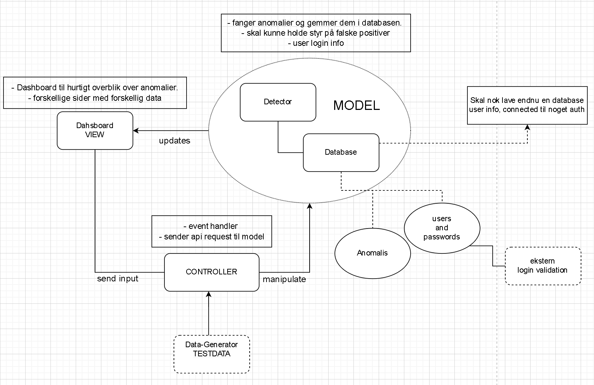

# Sprint 1 Software Architecture

## Beslutninger

### UML over overordnet Software struktur

### Generelt

- Programmeringssprog er python og SQL
- Dashboard er skrevet i DashPython
- Kommunikation mellem komponenter sker igennem REST API’er
- Navngivningskonvertioner
    - Det vi er vant til fra C#
        - Store bogstaver for metoder, små bogstaver for variabler, Caps for Final variabler
    - Ikke hav for lange navne - Hellere for langt, som er beskrivende end dumme forkortelser
    - Hav klart beskrivende navne
- Strive to uphold SOLID principles
- Comments
    - Skriv one liners til den overordnede funktionalitet af en metode
    - Hvis der er behov for mere uddybende forklaring på enkelte linjer, skriv en præcis beskrivelse ud fra given linje
    - ikke skriv en massiv blok af kommentar
- Security
    - brug Source Sink analysis
    - Proxy pattern til at beskytte databasen

### GitHub

- Commits
    - Lav små commits - ikke store commits
    - Hver gang man er færdig med en del af en funktion skal man committe det
    - Mind gerne hinanden om at committee - dette sker til hvert møde
    - Man må
- Branches
    - Lav KUN branches ud fra main
    - Lav ikke branches ud fra andres branches
- GitHub workflow
    - Dependabot
    - Linter - Flake8
    - Tests(når de er lavet)
    - commit frequency
        - minimum en gang om ugen

### Constraints

- Store datamængde
- Kunde data security wise
- Alt kode skal være i en container
- scalability